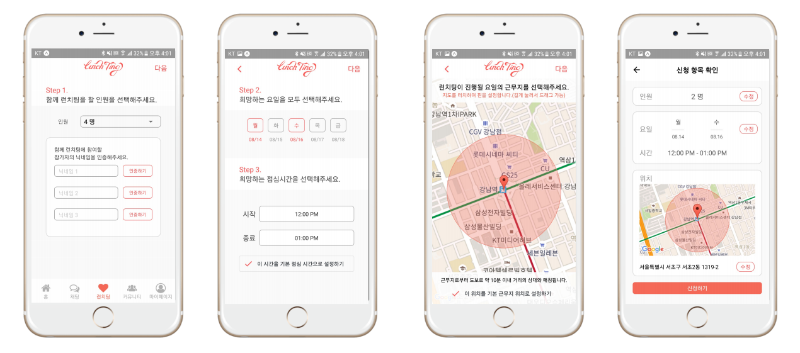

# Lunchting - 직장인을 위한 미팅 서비스(Beta)
by using React Native with Expo

>> [ 해커톤 발표 자료 : https://github.com/poongnewga/Presentation_For_Lunchting ](https://github.com/poongnewga/Presentation_For_Lunchting)

Android/iOS 모든 플랫폼 위에서 동작하는 네이티브 어플리케이션입니다.

토큰 기반의 인증 및 HTTP 통신으로 Rails 서버, 채팅 서버와 상호작용합니다.

주 기능은 다음과 같습니다.

- 명함 사진을 카메라로 찍어 회원가입
- 각종 공지 Push 알림
- 지도에 터치 & 드래그로 위치 핀 설정
- 위치 및 시간 기반 미팅 신청
- 거리, 나이 등 데이터 기반 미팅 매칭
- 매칭 인원들 간 실시간 채팅
- 커뮤니티 및 마이페이지
